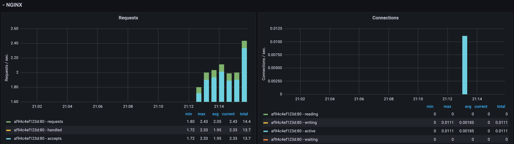
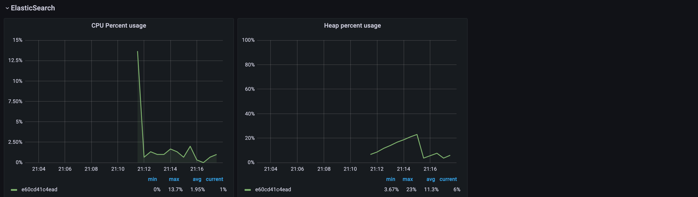

# Telegraf Metrics

- Run `start-containers.sh`, so all the required containers are created
- Visit http://localhost:3000/ to see the metrics in Grafana
- Import the Telegraf dashboard https://grafana.com/grafana/dashboards/61-telegraf-metrics/ in Grafana
- Run `seige-script.sh` in order to simulate highload on the system
- Observe the metrics on Grafana




# Running the Application without Nginx

Follow these steps to set up MongoDB and Elasticsearch locally using Docker

### 1. Pull the Docker Images

Start by pulling the required Docker images for MongoDB and Elasticsearch:

```bash
docker pull mongo:latest
docker pull docker.elastic.co/elasticsearch/elasticsearch:8.14.3
```

### 2. Run the containers
```bash
   docker run -d -p 27017:27017 --name=mongo-example mongo:latest
   docker run -d --name elasticsearch \
   -p 9200:9200 -p 9300:9300 \
   -e "discovery.type=single-node" \
   -e "xpack.license.self_generated.type=basic" \
   -e "xpack.security.enabled=false" \
   docker.elastic.co/elasticsearch/elasticsearch:8.14.3
   ```

### 3. Call the endpoints
   Save some random data automatically generated in MongoDB and Elasticsearch making a POST request (Postman can be used): http://localhost:8080/save
### 4. Check data in MongoDB and Elasticsearch
   MongoDB: connect to the database using Intellij

   Elasticsearch: use the link http://localhost:9200/datainfo/_search?pretty in your browser

# Testing with Nginx

- Make a POST request to http://localhost:8081
- This will automatically make a call to the application save endpoint http://localhost:8080/save


